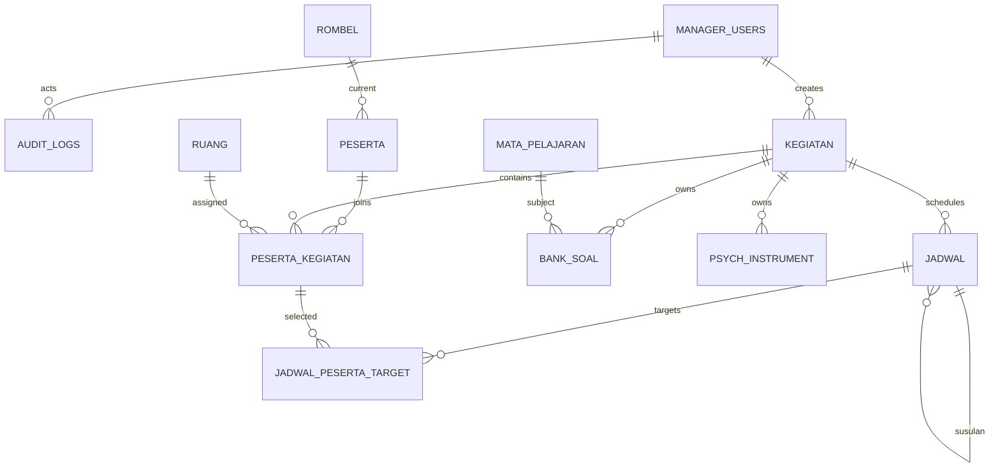
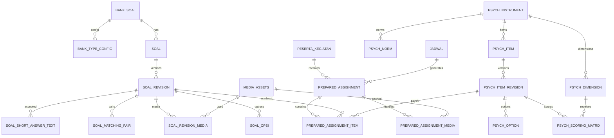
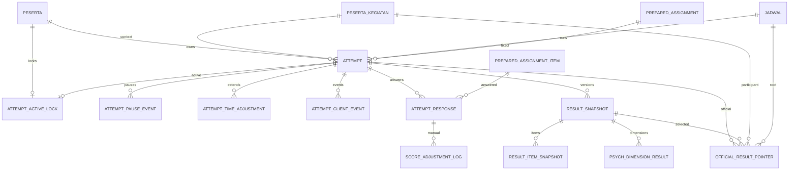

# CBT-HERO — DATABASE & ERD FINAL

**Versi:** 1.0  
**Tanggal:** 25 September 2026  
**Status:** **FINAL BASELINE / DOKUMEN TURUNAN NORMATIF**  
**Induk:** `CBT-HERO_DOKUMEN_ACUAN_UTAMA.md`  
**Target DBMS:** MySQL/MariaDB dengan `utf8mb4`, InnoDB, foreign key aktif

---

## 0. TUJUAN DAN BATAS

Dokumen ini adalah acuan final untuk membangun schema CBT-HERO. Ia menerjemahkan requirement yang sudah FIX menjadi:

- tabel;
- kolom;
- tipe data;
- primary/foreign key;
- unique constraint;
- index;
- lifecycle data;
- transaction boundary;
- ERD.

Dokumen ini **tidak boleh mengubah business rule** Dokumen Acuan Utama.

Prinsip database:

1. data ujian/histori tidak ditimpa untuk “mempermudah” retry;
2. Attempt, Prepared Assignment, response, dan result harus dapat diaudit;
3. START harus ringan;
4. query monitoring harus memiliki index yang jelas;
5. tidak ada `ORDER BY RAND()` saat mass START;
6. JSON/LONGTEXT hanya untuk payload yang memang fleksibel; relasi inti tetap normalized;
7. foreign key memakai InnoDB;
8. transaksi dipakai pada START, sync penting, Reset Akses, finalize, replacement, dan perubahan official result;
9. `peserta`, membership, dan credential terkait tidak diubah ketika Kegiatan yang melibatkan peserta sudah BERJALAN;
10. Live Edit soal menggunakan revision, bukan overwrite tanpa histori.

---

# 1. KONVENSI SCHEMA

## 1.1 Primary Key

Semua entitas utama menggunakan:

```sql
BIGINT UNSIGNED AUTO_INCREMENT
```

kecuali tabel singleton/lock yang memang mempunyai key khusus.

## 1.2 Waktu

Gunakan `DATETIME` dengan timezone aplikasi konsisten. Waktu bisnis disimpan sebagai timestamp server; client tidak menjadi authority.

Kolom standar bila relevan:

```text
created_at
updated_at
created_by
updated_by
```

## 1.3 Status

Status bisnis disimpan sebagai `VARCHAR`, bukan DB ENUM, agar migration/compatibility lebih mudah. Nilai valid dikontrol Service/Validator dan acceptance test.

## 1.4 JSON

Untuk kompatibilitas MySQL/MariaDB/shared hosting, payload fleksibel dapat disimpan sebagai `LONGTEXT` berisi JSON valid. Application layer bertanggung jawab melakukan encode/decode dan schema validation.

## 1.5 Delete Policy

- histori Attempt/Response/Result tidak dihapus oleh workflow normal;
- master yang sudah direferensikan dinonaktifkan, bukan dihapus paksa;
- child dari Bank/Instrumen DRAFT boleh dihapus bersama parent sebelum dipakai;
- destructive cleanup hanya melalui modul Pengosongan Data Admin.

---

# 2. DOMAIN TABLE MAP

```text
SYSTEM
├── sys_settings
├── credential_operations
├── manager_users
├── auth_login_attempts
├── audit_logs
├── ci_sessions
├── token_control
└── live_scoring_config

MASTER
├── rombel
├── mata_pelajaran
└── peserta

KEGIATAN
├── kegiatan
├── ruang
└── peserta_kegiatan

MEDIA / IMPORT
├── media_assets
├── import_jobs
└── import_staging_items

BANK AKADEMIK
├── bank_soal
├── bank_type_config
├── soal
├── soal_revision
├── soal_opsi
├── soal_matching_pair
├── soal_short_answer_text
└── soal_revision_media

PSIKOLOGIS
├── psych_instrument
├── psych_dimension
├── psych_item
├── psych_item_revision
├── psych_option
├── psych_scoring_matrix
├── psych_norm
└── psych_item_revision_media

JADWAL / PREPARATION
├── jadwal
├── jadwal_peserta_target
├── prepared_assignment
├── prepared_assignment_item
└── prepared_assignment_media

ATTEMPT / RUNTIME
├── attempt
├── attempt_active_lock
├── attempt_pause_event
├── attempt_time_adjustment
├── attempt_client_event
└── attempt_response

SCORING / RESULT
├── score_adjustment_log
├── result_snapshot
├── result_item_snapshot
├── official_result_pointer
└── psych_dimension_result
```

Total baseline: **49 tabel**, termasuk `ci_sessions`.

---

# 3. SYSTEM TABLES

## 3.1 `sys_settings`

Menyimpan setting sistem key-value termasuk Credential Encryption Key.

| Kolom | Tipe | Aturan |
|---|---|---|
| id | BIGINT UNSIGNED | PK |
| setting_key | VARCHAR(100) | UNIQUE, NOT NULL |
| setting_value | LONGTEXT | NOT NULL |
| value_type | VARCHAR(20) | STRING/INT/BOOL/JSON/SECRET |
| is_secret | TINYINT(1) | default 0 |
| updated_by | BIGINT UNSIGNED | FK manager_users, nullable |
| created_at | DATETIME | NOT NULL |
| updated_at | DATETIME | NOT NULL |

Contoh key:

```text
credential_encryption_key
institution_name
institution_logo
institution_address
cbt_public_url
timezone
participant_default_instruction
log_retention_days
```

`is_secret=1` tidak boleh ditampilkan UI biasa/log/debug response.

## 3.2 `manager_users`

Akun Admin/Operator.

| Kolom | Tipe | Aturan |
|---|---|---|
| id | BIGINT UNSIGNED | PK |
| username | VARCHAR(64) | UNIQUE |
| nama | VARCHAR(150) | NOT NULL |
| password_hash | VARCHAR(255) | NOT NULL |
| role | VARCHAR(20) | ADMIN/OPERATOR |
| status | VARCHAR(20) | ACTIVE/INACTIVE |
| failed_login_count | INT UNSIGNED | default 0 |
| locked_until | DATETIME | nullable |
| last_login_at | DATETIME | nullable |
| created_at/updated_at | DATETIME | |

## 3.3 `auth_login_attempts`

Log login ringkas untuk throttling/audit.

| Kolom | Tipe |
|---|---|
| id | BIGINT UNSIGNED PK |
| realm | VARCHAR(20) |
| username_input | VARCHAR(100) |
| account_ref_id | BIGINT UNSIGNED nullable |
| ip_address | VARCHAR(45) nullable |
| user_agent | VARCHAR(500) nullable |
| success | TINYINT(1) |
| failure_reason | VARCHAR(100) nullable |
| attempted_at | DATETIME |

Index `(realm, username_input, attempted_at)` dan `(ip_address, attempted_at)`.

## 3.4 `audit_logs`

Audit business/destructive action.

Kolom minimum:

```text
id
actor_realm
actor_id
action
module
entity_type
entity_id
description
before_json
after_json
ip_address
user_agent
created_at
```

Audit log tidak dipakai sebagai tabel telemetry exam per detik.

## 3.5 `ci_sessions`

Gunakan schema CI4 Database Session Handler. Manager/Participant tetap dua auth realm pada application layer, walaupun storage session dapat memakai tabel fisik yang sama.

## 3.6 `token_control`

Singleton global Token.

```text
id = 1
enabled
current_token
auto_rotate_minutes
rotated_at
next_rotate_at
updated_by
updated_at
```

Token bukan milik Kegiatan/Jadwal/Ruang.

## 3.7 `live_scoring_config`

Singleton konfigurasi display publik.

```text
id = 1
enabled
jadwal_id
public_token
public_token_version
started_at
stopped_at
updated_by
updated_at
```

Satu display publik hanya menunjuk **satu Jadwal** pada satu waktu.

## 3.8 `credential_operations`

`idempotency_key` unik, `action`, `payload_hash`, `status`, `affected_count`,
`created_by`, `created_at`, dan `finished_at`. Mencatat hasil operasi credential
massal agar request yang sama tidak mereset ulang password. Tidak menyimpan
password plaintext atau daftar password hasil generate.

---

# 4. MASTER TABLES

## 4.1 Konteks Tahun Pelajaran dan Semester

`sys_settings` menyimpan default pengisian Kegiatan (`default_tahun_pelajaran`, `default_semester`). Nilai Tahun Pelajaran dan Semester disalin ke `kegiatan` saat dibuat. Perubahan default tidak mengubah riwayat Kegiatan. Tidak ada tabel `periode` atau status aktif tunggal.

## 4.2 `rombel`

```text
id
tingkat
kode_rombel
display_name
status
created_at
updated_at
```

Unique `(tingkat, kode_rombel)`.

## 4.3 `mata_pelajaran`

```text
id
kode_mapel UNIQUE
nama_mapel
singkatan
status
urutan
created_at
updated_at
```

## 4.4 `peserta`

Master peserta sekaligus account participant.

```text
id
nisn UNIQUE
nama
jenis_kelamin
rombel_id
status
keterangan
username UNIQUE nullable
password_hash nullable
password_encrypted nullable
credential_status
credential_revision
failed_login_count
locked_until
last_login_at
credential_changed_at
created_at
updated_at
```

Aturan:

- Username disimpan/display uppercase;
- login username case-insensitive melalui normalisasi uppercase;
- generated Username/Password menghindari `O I L 0 1`;
- password auth memakai `password_hash/password_verify`;
- `password_encrypted` hanya untuk cetak ulang credential;
- ketika peserta terlibat Kegiatan BERJALAN, perubahan data peserta diblok Service.

---

# 5. KEGIATAN & MEMBERSHIP

## 5.1 `kegiatan`

```text
id
nama
jenis                 AKADEMIK / PSIKOLOGIS
tahun_pelajaran
semester
keterangan
status                DRAFT / BERJALAN / SELESAI
exam_browser_required
created_by
created_at
updated_at
```

Kegiatan tidak menyimpan Mapel, durasi, Token, atau Ruang secara langsung.

## 5.2 `ruang`

```text
id
kode UNIQUE
nama
status
created_at
updated_at
```

Reusable lintas Kegiatan.

## 5.3 `peserta_kegiatan`

Membership eksplisit.

```text
id
kegiatan_id
peserta_id
ruang_id nullable
nomor_peserta nullable
status
nisn_snapshot
nama_snapshot
jenis_kelamin_snapshot
rombel_snapshot
created_at
updated_at
```

Unique:

```text
(kegiatan_id, peserta_id)
(kegiatan_id, nomor_peserta)
```

Snapshot membership mempertahankan identitas historis. Membership/ruang/no peserta dikunci ketika Kegiatan BERJALAN, kecuali workflow khusus yang memang diizinkan requirement.

---

# 6. MEDIA & IMPORT STAGING

## 6.1 `media_assets`

```text
id
storage_type          LOCAL / EXTERNAL
media_kind            IMAGE / AUDIO / VIDEO / FILE
file_path nullable
provider nullable      contoh GDRIVE
external_id nullable
external_url nullable
mime_type
size_bytes
sha256
status
created_by
created_at
```

Local upload tidak executable.

## 6.2 `import_jobs`

Header setiap proses import.

```text
id
import_type           PESERTA / BANK_WORD / BANK_EXCEL / PSYCH_WORD / PSYCH_EXCEL
context_type
context_id
original_filename
stored_filename
status                UPLOADED/PARSED/VALIDATED/COMMITTED/FAILED
total_items
valid_items
invalid_items
created_by
created_at
validated_at
committed_at
```

## 6.3 `import_staging_items`

```text
id
import_job_id
item_no
source_ref
payload_json
validation_status     VALID/INVALID/EXCLUDED
errors_json
committed_entity_type
committed_entity_id
created_at
```

Commit ke Bank/Instrumen hanya dari staging yang valid.

---

# 7. BANK SOAL AKADEMIK

## 7.1 `bank_soal`

```text
id
kegiatan_id
mapel_id
tingkat
nama_bank
status                DRAFT/READY
version_no
fingerprint
created_by
updated_by
created_at
updated_at
```

Bank dimiliki Kegiatan; tidak ada clone/reuse requirement.

## 7.2 `bank_type_config`

Satu row per tipe soal yang digunakan Bank.

```text
id
bank_soal_id
question_type
selection_count nullable
weight_percent
shuffle_questions
shuffle_options
scoring_mode nullable
created_at
updated_at
```

Unique `(bank_soal_id, question_type)`.

Saat Bank menjadi READY:

- total weight tipe aktif harus 100;
- selection count harus dapat dipenuhi;
- randomization rule tervalidasi.

## 7.3 `soal`

Stable identity soal.

```text
id
bank_soal_id
stable_key
current_revision_no
status                ACTIVE/VOID
sort_order
created_at
updated_at
```

Unique `stable_key`.

## 7.4 `soal_revision`

Revision immutable.

```text
id
soal_id
revision_no
question_type
stimulus_html
question_html
max_point
scoring_mode nullable
short_answer_mode nullable
expected_numeric nullable
numeric_tolerance nullable
rubric_html nullable
rubric_json nullable
metadata_json nullable
change_kind
change_note
created_by
created_at
```

Unique `(soal_id, revision_no)`.

`change_kind` minimum:

```text
INITIAL
CONTENT
KEY_WEIGHT
STRUCTURAL
VOID
```

Prepared Assignment menunjuk revision spesifik.

## 7.5 `soal_opsi`

Opsi revision-specific untuk PG/PG Kompleks/PG Bertingkat.

```text
id
soal_revision_id
option_key
content_html
is_correct nullable
point_value nullable
sort_order
metadata_json nullable
```

Unique `(soal_revision_id, option_key)`.

## 7.6 `soal_matching_pair`

```text
id
soal_revision_id
left_key
left_html
right_key
right_html
sort_order
```

Satu row mendefinisikan mapping benar `left_key → right_key`.

## 7.7 `soal_short_answer_text`

Daftar accepted answer mode TEXT.

```text
id
soal_revision_id
accepted_value
normalized_value
sort_order
```

Mode NUMERIC memakai `expected_numeric` + `numeric_tolerance` pada revision.

## 7.8 `soal_revision_media`

Pivot media revision:

```text
id
soal_revision_id
media_asset_id
media_role
option_key nullable
sort_order
```

---

# 8. INSTRUMEN PSIKOLOGIS

## 8.1 `psych_instrument`

```text
id
kegiatan_id
nama
version_label
status                 DRAFT/READY
scoring_model
allow_shuffle
notes
created_by
updated_by
created_at
updated_at
```

## 8.2 `psych_dimension`

```text
id
psych_instrument_id
code
name
description
sort_order
```

Unique `(psych_instrument_id, code)`.

## 8.3 `psych_item`

Stable identity item.

```text
id
psych_instrument_id
stable_key
current_revision_no
status
sort_order
created_at
updated_at
```

## 8.4 `psych_item_revision`

```text
id
psych_item_id
revision_no
item_type              LIKERT / FORCED_CHOICE
content_html
reverse_scoring
randomization_allowed
metadata_json
change_kind
change_note
created_by
created_at
```

## 8.5 `psych_option`

```text
id
psych_item_revision_id
option_key
content_html
sort_order
metadata_json
```

## 8.6 `psych_scoring_matrix`

Generic option/response-role → dimension points.

```text
id
psych_item_revision_id
psych_option_id
psych_dimension_id
response_role          SELECT / MOST / LEAST
points
```

## 8.7 `psych_norm`

```text
id
psych_instrument_id
psych_dimension_id nullable
norm_group
min_score
max_score
category
interpretation
sort_order
```

Norma hanya diisi bila instrumen memang menyediakan data norma/interpretasi.

## 8.8 `psych_item_revision_media`

Pivot item revision ke `media_assets`.

---

# 9. JADWAL

## 9.1 `jadwal`

Satu tabel untuk Jadwal utama dan seluruh Susulan.

```text
id
kegiatan_id
bank_soal_id nullable
psych_instrument_id nullable
parent_jadwal_id nullable
jenis_jadwal          MAIN / SUSULAN
mulai_at
batas_mulai_at
durasi_seconds
access_state          BUKA / TAHAN
tampilkan_nilai_saat_selesai
result_visibility_locked_at nullable
first_attempt_started_at nullable
results_finalized_at nullable
results_finalized_by nullable
created_by
created_at
updated_at
```

Aturan:

- tepat satu dari `bank_soal_id` atau `psych_instrument_id` terisi;
- `parent_jadwal_id` NULL untuk MAIN;
- Susulan menunjuk Jadwal utama;
- jumlah Susulan tidak dibatasi artificial;
- Susulan dapat dibuat sebagai pengecualian operasional walaupun Kegiatan sudah SELESAI;
- setting `Tampilkan Nilai Saat Selesai` terkunci setelah Attempt pertama START;
- selama BERJALAN hanya extension `batas_mulai_at` dan penambahan waktu yang diizinkan sesuai requirement;
- `results_finalized_at` mengunci perubahan scoring normal untuk Jadwal tersebut, tanpa menghalangi histori/official result dari Susulan lain.

## 9.2 `jadwal_peserta_target`

Materialized target peserta Jadwal.

```text
id
jadwal_id
peserta_kegiatan_id
target_mode            FIRST_ATTEMPT / REPLACEMENT
supersede_attempt_id nullable
status                 TARGETED/CANCELLED
created_by
created_at
```

Unique `(jadwal_id, peserta_kegiatan_id)`.

Untuk MAIN, target dapat dimaterialisasi dari tingkat/rombel/membership saat preparation. Untuk Susulan, target selalu eksplisit.

---

# 10. PREPARATION / PREPARED ASSIGNMENT

## 10.1 `prepared_assignment`

Header assignment stabil sebelum peak.

```text
id
generated_for_jadwal_id
peserta_kegiatan_id
assignment_seq
source_version
fingerprint
status                 READY/STALE/USED/SUPERSEDED
generated_at
used_at nullable
created_by nullable
```

Unique:

```text
(generated_for_jadwal_id, peserta_kegiatan_id, assignment_seq)
```

Never-start Susulan boleh menggunakan assignment existing yang relevan. Replacement selalu mendapat assignment baru.

## 10.2 `prepared_assignment_item`

```text
id
prepared_assignment_id
sequence_no
soal_id nullable
soal_revision_id nullable
psych_item_id nullable
psych_item_revision_id nullable
option_order_json nullable
mapping_json nullable
metadata_json nullable
```

Exactly one source pair digunakan:

```text
Academic → soal_id + soal_revision_id
Psych    → psych_item_id + psych_item_revision_id
```

Unique `(prepared_assignment_id, sequence_no)`.

Tidak ada randomisasi ulang pada START.

## 10.3 `prepared_assignment_media`

Critical-media manifest:

```text
id
prepared_assignment_id
media_asset_id
is_critical
prefetch_order
```

---

# 11. ATTEMPT ENGINE

## 11.1 `attempt`

```text
id
peserta_id
peserta_kegiatan_id
jadwal_id
root_jadwal_id
prepared_assignment_id
attempt_no
supersedes_attempt_id nullable
status                 ACTIVE/FINISHED/SUPERSEDED
finish_reason nullable  SUBMIT/TIMEOUT/FORCE_FINISH
client_uuid nullable
client_generation
auth_generation
start_at
finish_at nullable
deadline_at
pause_started_at nullable
duration_seconds_snapshot
added_seconds
paused_seconds
server_sync_revision
last_sync_at nullable
last_activity_at nullable
scoring_status          NOT_SCORED/NEEDS_MANUAL/SCORED
nomor_peserta_snapshot
username_snapshot
nama_snapshot
rombel_snapshot
ruang_snapshot
created_at
updated_at
```

`deadline_at` adalah server-authoritative effective deadline. Saat Reset Akses pause dimulai; pada RESUME deadline digeser sejumlah durasi pause. Tambah Waktu menambah `deadline_at` dan dicatat pada event table.

## 11.2 `attempt_active_lock`

Mencegah satu peserta mempunyai dua Attempt ACTIVE tanpa mengandalkan partial unique index.

```text
peserta_id PK
attempt_id UNIQUE
acquired_at
```

START harus memperoleh row lock ini dalam transaksi. FINISH/SUPERSEDE melepaskannya.

Ini mengimplementasikan:

```text
ONE PARTICIPANT = MAXIMUM ONE ACTIVE ATTEMPT
```

## 11.3 `attempt_pause_event`

Audit Reset Akses / Resume.

```text
id
attempt_id
started_at
ended_at nullable
paused_seconds nullable
reason
started_by
ended_by nullable
created_at
```

Network putus/browser ditutup **tidak membuat pause**.

## 11.4 `attempt_time_adjustment`

Audit Tambah Waktu.

```text
id
attempt_id
seconds_added
reason
created_by
created_at
```

Hanya penambahan waktu saat ujian berjalan.

## 11.5 `attempt_client_event`

Event client yang bermakna saja.

```text
id
attempt_id
client_generation
event_type
metadata_json
created_at
```

Tidak digunakan untuk polling/focus spam.

## 11.6 `attempt_response`

Satu response per assigned item.

```text
id
attempt_id
prepared_assignment_item_id
answer_payload
client_revision
server_revision
client_elapsed_ms nullable
answered_at_client nullable
received_at
is_flagged
auto_score nullable
manual_score nullable
effective_score nullable
scoring_state
last_mutation_id nullable
updated_at
```

Unique:

```text
(attempt_id, prepared_assignment_item_id)
```

Aturan sync:

- local IndexedDB commit lebih dulu;
- client revision lebih tinggi menggantikan revision lama;
- duplicate/old revision di-ignore + ACK;
- `server_revision` meningkat untuk accepted mutation;
- response yang tersimpan lokal sebelum timeout boleh dikirim ketika jaringan kembali sesuai timeout contract; input baru setelah timer 0 dikunci client;
- response tetap terikat revision yang diberikan Prepared Assignment.

---

# 12. SCORING & RESULT

## 12.1 `score_adjustment_log`

Audit manual score/override.

```text
id
attempt_response_id
old_manual_score nullable
new_manual_score nullable
old_effective_score nullable
new_effective_score nullable
reason
created_by
created_at
```

Tidak boleh ditambah setelah Jadwal FINAL.

## 12.2 `result_snapshot`

Immutable scoring snapshot.

```text
id
attempt_id
jadwal_id
snapshot_version
result_type            AKADEMIK/PSIKOLOGIS
click_score nullable
typed_score nullable
final_score nullable
scoring_status
payload_json nullable
is_final
created_at
finalized_at nullable
```

Jika ada rescore sebelum finalization, buat snapshot versi baru; jangan overwrite snapshot lama.

## 12.3 `result_item_snapshot`

Item-level snapshot akademik/response untuk audit/report.

```text
id
result_snapshot_id
prepared_assignment_item_id
question_type nullable
raw_score nullable
max_point nullable
type_weight_percent nullable
weighted_score nullable
voided
payload_json nullable
```

## 12.4 `official_result_pointer`

Menentukan hasil resmi saat ini tanpa mengubah snapshot historis.

```text
id
root_jadwal_id
peserta_kegiatan_id
attempt_id
result_snapshot_id
updated_at
```

Unique `(root_jadwal_id, peserta_kegiatan_id)`.

Replacement Susulan membuat hasil baru dan pointer dapat dipindahkan ke hasil terbaru. Snapshot lama tetap utuh.

## 12.5 `psych_dimension_result`

```text
id
result_snapshot_id
psych_dimension_id
raw_score
normalized_score nullable
category nullable
interpretation nullable
sort_order
```

---

# 13. SCORING MODEL YANG DICERMINKAN DATABASE

Engine teknis akademik:

```text
PG
PG_KOMPLEKS
MATCHING
ISIAN_SINGKAT
URAIAN
PG_BERTINGKAT
```

UI/result grouping:

```text
PILIHAN GANDA / KLIK
= PG + PG Kompleks + Matching + PG Bertingkat

ISIAN & URAIAN / KETIK
= Isian Singkat + Uraian
```

`bank_type_config.weight_percent` menyimpan bobot per tipe teknis. Nilai kelompok adalah normalisasi kontribusi tipe yang masuk kelompok tersebut, bukan rata-rata sederhana antarjenis.

PG Kompleks:

```text
(correct_selected - wrong_selected) / total_correct
clamp 0..1
× max_point
```

Matching mengikuti scoring mode revision (`PARTIAL` atau `ALL_OR_NOTHING`).

Isian TEXT memakai accepted answer + normalisasi. Isian NUMERIC memakai expected numeric + optional absolute tolerance.

VOID tidak menghapus response; scoring mengeluarkan item dari denominator dan menyimpan histori.

---

# 14. SERVER-AUTHORITY TIMER CONTRACT

At START:

```text
start_at = server time
deadline_at = start_at + duration
```

Tambah Waktu:

```text
deadline_at += seconds_added
```

Reset Akses:

```text
pause_started_at = server time
client_generation++
```

Resume:

```text
pause = now - pause_started_at
paused_seconds += pause
deadline_at += pause
pause_started_at = NULL
```

Network putus/browser close/HP mati tidak mengubah deadline.

Saat client timer 0:

```text
LOCK INPUT
→ flush queue bila online
→ jika offline: TIMEOUT_PENDING lokal
→ ketika online: kirim queue lama
→ server finalize
```

`Batas Mulai` hanya menentukan boleh/tidaknya START baru; bukan deadline finish.

---

# 15. START TRANSACTION — WAJIB ATOMIC

START harus dilakukan dalam transaksi pendek:

```text
1. Validasi account/session
2. Validasi target Jadwal
3. Validasi BUKA/TAHAN
4. Validasi Mulai/Batas Mulai
5. Validasi Token jika ON
6. Validasi Exam Browser jika required
7. Validasi Prepared Assignment READY
8. Acquire attempt_active_lock(peserta_id)
9. Insert Attempt ACTIVE
10. Mark Prepared Assignment USED
11. Lock tampilkan_nilai_saat_selesai jika START pertama Jadwal
12. COMMIT
```

Jika salah satu gagal, tidak boleh ada Attempt setengah jadi.

START **tidak** menjalankan randomisasi berat atau materialisasi soal massal.

---

# 16. ANSWER SYNC TRANSACTION

Untuk setiap mutation atau batch kecil:

```text
1. Validasi Attempt + client_generation
2. Validasi assigned item
3. Bandingkan client_revision
4. Jika revision lama/duplicate → ACK tanpa perubahan
5. Jika baru → update/insert response
6. Increment server_sync_revision
7. Update last_sync_at
8. COMMIT
```

Batch harus dibatasi agar lock tidak panjang.

---

# 17. RESET AKSES TRANSACTION

```text
1. Lock Attempt ACTIVE
2. Jika belum pause → create attempt_pause_event
3. Set pause_started_at
4. Increment client_generation
5. Audit
6. COMMIT
```

Active Attempt lock **tetap ada**, karena peserta belum boleh START ujian lain.

Resume menutup pause event dan menggeser deadline.

---

# 18. FINALIZE TRANSACTION

Normal submit/timeout:

```text
1. Lock Attempt
2. Pastikan status ACTIVE
3. Terima mutation valid yang sudah masuk
4. Set FINISHED + finish_reason + finish_at
5. Hapus attempt_active_lock
6. Compute/update scoring state
7. Create result_snapshot version
8. Update official_result_pointer bila memenuhi rule official
9. COMMIT
```

Uraian yang belum dinilai menghasilkan `NEEDS_MANUAL`; Attempt tetap FINISHED.

Finalisasi Hasil Jadwal (`results_finalized_at`) berbeda dari FINISH Attempt.

---

# 19. REPLACEMENT SUSULAN

Replacement tidak menghapus Attempt lama.

```text
Attempt lama
→ SUPERSEDED
→ snapshot tetap ada

Susulan replacement
→ Prepared Assignment baru
→ Attempt baru
→ scoring/result baru
→ official_result_pointer pindah bila hasil baru menjadi official
```

Satu Jadwal utama dapat memiliki N Susulan. Susulan tetap child dari MAIN, bukan chain child-of-child.

---

# 20. LOCK DATA PESERTA

Saat Kegiatan BERJALAN, Service harus menolak perubahan peserta yang terikat Kegiatan tersebut pada data yang mempengaruhi pelaksanaan:

- NISN/nama/JK;
- rombel;
- username/password;
- nomor peserta;
- ruang;
- membership Kegiatan.

Attempt menyimpan snapshot tambahan agar laporan historis tetap stabil.

Live Edit Soal adalah jalur khusus dan **bukan pengecualian untuk perubahan data peserta**.

---

# 21. INDEX FINAL MINIMUM

## Auth/Master

```text
peserta(username)
peserta(nisn)
auth_login_attempts(realm, username_input, attempted_at)
auth_login_attempts(ip_address, attempted_at)
```

## Kegiatan/Jadwal

```text
peserta_kegiatan(kegiatan_id, peserta_id) UNIQUE
peserta_kegiatan(kegiatan_id, nomor_peserta) UNIQUE
peserta_kegiatan(kegiatan_id, ruang_id)
jadwal(kegiatan_id, mulai_at)
jadwal(parent_jadwal_id)
jadwal_peserta_target(jadwal_id, peserta_kegiatan_id) UNIQUE
```

## Preparation

```text
prepared_assignment(generated_for_jadwal_id, peserta_kegiatan_id, status)
prepared_assignment(peserta_kegiatan_id, status)
prepared_assignment_item(prepared_assignment_id, sequence_no) UNIQUE
```

## Attempt/Monitoring

```text
attempt(peserta_id, status)
attempt(jadwal_id, status, last_sync_at)
attempt(root_jadwal_id, peserta_kegiatan_id)
attempt(status, last_activity_at)
attempt_active_lock(peserta_id) PRIMARY KEY
attempt_response(attempt_id, prepared_assignment_item_id) UNIQUE
attempt_response(attempt_id, server_revision)
```

## Results

```text
result_snapshot(attempt_id, snapshot_version) UNIQUE
official_result_pointer(root_jadwal_id, peserta_kegiatan_id) UNIQUE
psych_dimension_result(result_snapshot_id, psych_dimension_id)
```

## Bank

```text
soal(bank_soal_id, status, sort_order)
soal_revision(soal_id, revision_no) UNIQUE
soal_opsi(soal_revision_id, sort_order)
psych_item(psych_instrument_id, status, sort_order)
```

---

# 22. ERD — CORE / MASTER / KEGIATAN



---

# 23. ERD — BANK / REVISION / PREPARATION



---

# 24. ERD — ATTEMPT / RESPONSE / RESULT



---

# 25. DERIVED/CACHE DATA — BUKAN SOURCE OF TRUTH

Data berikut boleh dihitung/cached dan boleh direbuild:

- Monitoring summary;
- Live Scoring ranking snapshot;
- question analysis aggregate;
- dashboard metrics;
- precomputed report matrix;
- media prefetch cache.

Source of truth tetap:

```text
Master + Membership
Prepared Assignment
Attempt
Attempt Response
Result Snapshot
Official Result Pointer
```

---

# 26. MIGRATION / CREATE ORDER

Urutan pembuatan tabel:

```text
1. manager_users / sys_settings / session / audit
2. rombel / mapel / peserta
3. kegiatan / ruang / peserta_kegiatan
4. media / import
5. bank akademik + revisions
6. psych instrument + revisions
7. jadwal + target
8. prepared assignment
9. attempt + runtime tables
10. response + scoring audit
11. result snapshot + official pointer
12. live scoring config / final FK yang membutuhkan jadwal
```

Seed minimum:

- Admin bootstrap;
- `token_control id=1`;
- `live_scoring_config id=1`;
- system settings default;
- credential encryption key generated sekali jika belum ada.

---

# 27. ACCEPTANCE CHECK DATABASE

Database dianggap PASS jika minimal:

- duplicate NISN ditolak;
- duplicate Username ditolak;
- duplicate peserta pada Kegiatan ditolak;
- duplicate Nomor Peserta dalam Kegiatan ditolak;
- dua Attempt ACTIVE peserta yang sama tidak dapat terbentuk;
- START gagal tidak meninggalkan Attempt orphan;
- response retry idempotent;
- Prepared Assignment tetap menunjuk revision yang benar setelah Live Edit;
- Reset Akses tidak menghapus response;
- replacement tidak menghapus Attempt/result lama;
- official pointer dapat berpindah tanpa mengubah snapshot lama;
- finalized Jadwal menolak manual score/key/VOID normal;
- Susulan N kali tetap mempunyai parent MAIN yang benar;
- monitoring query tidak melakukan full table scan untuk filter utama;
- Backup Database membawa Credential Encryption Key melalui `sys_settings`;
- restore DB mengembalikan kemampuan decrypt credential lama;
- cleanup/retention log tidak menyentuh histori Attempt/Result.

---

# 28. KEPUTUSAN FINAL DATABASE

Schema ini sengaja tidak mengikuti mentah-mentah database ZYA maupun Garuda.

ZYA/Garuda tetap berguna sebagai referensi perilaku, tetapi CBT-HERO membutuhkan struktur yang secara eksplisit mendukung:

- Prepared Assignment sebelum peak;
- client-local exam package;
- revision-safe answer sync;
- one active attempt;
- Reset Akses tanpa kehilangan jawaban;
- unlimited Susulan;
- replacement dengan histori;
- Live Edit revision;
- dua kelompok nilai UI;
- academic + psych engine dalam runtime yang sama;
- immutable result snapshot;
- official result pointer;
- Public Live Scoring ringan.

**Dokumen ini menjadi schema baseline yang harus diikuti saat membuat migration/SQL dan Model CI4.**
